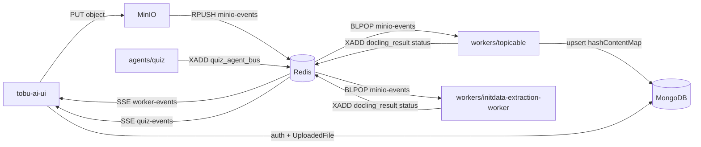

# Architecture — jobs, data, Redis

Top-level map of what each piece of **imbbox2** does, which stores it touches, and the canonical Redis keys. Schema details live in [`schema-registry/`](schema-registry/).

## System flow

## Redis naming (canonical)

| Kind | Name | Env vars | Producer | Consumer |
|------|------|----------|----------|----------|
| List | `minio-events` | `REDIS_EVENT_KEY`, `REDIS_EVENT_LIST` | MinIO notify | topicable / initdata (`BLPOP`) |
| Stream | `docling_result` | `STREAM_RESULT_KEY`, `REDIS_OUTPUT_STREAM` | topicable / initdata (`XADD` status only) | UI `/api/worker-events` |
| Stream | `quiz_agent_bus` | `QUIZ_AGENT_STREAM` | quiz agents (`XADD`) | quiz agents + UI `/api/quiz-events` |

Payload shapes: [`schema-registry/docling-result-event.json`](schema-registry/docling-result-event.json), [`schema-registry/quiz-agent-event.json`](schema-registry/quiz-agent-event.json). Full registry: [`schema-registry/redis-streams.json`](schema-registry/redis-streams.json).

Stream messages always use a single Redis field `payload` (JSON string).

## Config

- Committed template: [`.env.example`](.env.example)
- Local unified secrets (gitignored): `.env.all`
- Per-service `.env` / `.env.local` still work and override when loaded first

---

## Component jobs

### tobu-ai-ui

**Job:** Next.js app — auth, chat/dashboard UI, MinIO uploads, LiveKit token issuing, and SSE bridges that fan Redis streams out to the browser.

| Direction | Detail |
|-----------|--------|
| Inputs | HTTP (browser), Redis streams `docling_result` / `quiz_agent_bus`, Mongo |
| Outputs | MinIO uploads, Mongo user/session/upload docs, LiveKit tokens |
| Mongo | `User`, `Account`, `Session`, `Preferences`, `UploadedFile`, `EmailToken` — see [`schema-registry/index.json`](schema-registry/index.json) |
| Redis | Reads `docling_result`, `quiz_agent_bus` |

Key paths: `tobu-ai-ui/lib/db/`, `tobu-ai-ui/lib/redis.ts`, `app/api/worker-events/`, `app/api/quiz-events/`.

### workers/topicable

**Job:** Document + topic pipeline. Consume MinIO create events, convert to markdown (Docling / text paths), build a topic graph via LLM, cache under `hashContentMap`, publish status on the result stream.

| Direction | Detail |
|-----------|--------|
| Inputs | Redis list `minio-events`, MinIO object bytes, LLM |
| Outputs | Processed markdown in MinIO, Mongo `hashContentMap`, Redis `docling_result` (status only) |
| Mongo | `hashContentMap` — [`hash-content-map.json`](schema-registry/hash-content-map.json) |
| Redis | `BLPOP minio-events` → `XADD docling_result` |

Key paths: `workers/topicable/main.py`, `mongo.py`, `redis_io.py`, `config.py`.

### workers/initdata-extraction-worker

**Job:** Standalone Docling worker (no Celery in the main loop). Same list → MinIO → markdown → stream pattern as a simpler / legacy path alongside topicable.

| Direction | Detail |
|-----------|--------|
| Inputs | Redis list `minio-events`, MinIO |
| Outputs | Processed markdown in MinIO, Redis `docling_result` (status only) |
| Mongo | None (file metadata may be updated elsewhere) |
| Redis | `BLPOP minio-events` → `XADD docling_result` |

Key paths: `workers/initdata-extraction-worker/main.py`.

### agents/quiz

**Job:** Quiz LangGraph agents (LiveKit voice, question generator, answer analyzer) coordinating over a Redis stream keyed by `chatId`.

| Direction | Detail |
|-----------|--------|
| Inputs | HTTP agent endpoints, LiveKit room, Redis `quiz_agent_bus` |
| Outputs | Redis `quiz_agent_bus` events (`question_ready`, `score_ready`, …) |
| Mongo | None (message models only) |
| Redis | `quiz_agent_bus` |
| Message models | `QuestionItem`, `ScoreResult` — [`question-item.json`](schema-registry/question-item.json), [`score-result.json`](schema-registry/score-result.json) |

Key paths: `agents/quiz/shared/redis_bus.py`, `agents/quiz/shared/models.py`.

### agents/topic

**Out of scope here** (workspace rule: do not visit `topic`). Treat as a separate agent service unless documented elsewhere.

### imb / agent-starter-react

**Out of scope** for this registry pass — starter / voice scaffolding, not wired into the schema registry.

---

## Mongo collections (summary)

| Collection | Owner | Schema file |
|------------|-------|-------------|
| users | tobu-ai-ui | `user.json` |
| accounts | tobu-ai-ui | `account.json` |
| sessions | tobu-ai-ui | `session.json` |
| preferences | tobu-ai-ui | `preferences.json` |
| uploadedfiles | tobu-ai-ui | `uploaded-file.json` |
| emailtokens | tobu-ai-ui | `email-token.json` |
| hashContentMap | topicable | `hash-content-map.json` |

---

## Notes

- Prefer the canonical names above; older defaults (`docling_result`, `minio-events-queue`, `minio_events`) are deprecated.
- topicable result payloads use camelCase (`sessionId`, `uploadKey`); initdata/UI historically use snake_case (`session_id`, `file_key`). Both are documented in `docling-result-event.json` until a single payload dialect is enforced.
